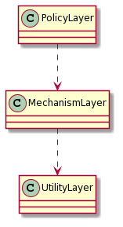
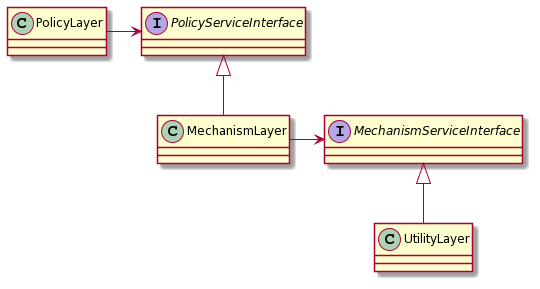
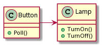
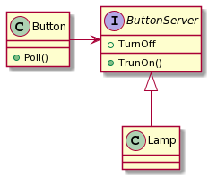
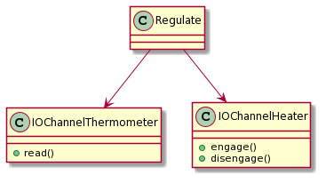
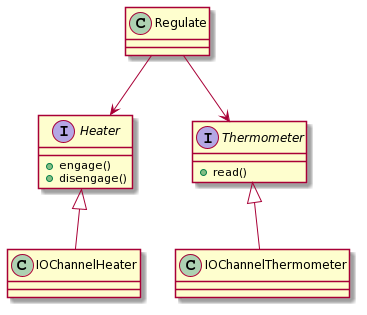

> 첫째, 상위 모듈은 하위 모듈에 의존해서는 안된다. 상위 모듈과 하위 모듈 모두 추상화에 의존해야 한다.
> 둘째, 추상화는 세부 사항에 의존해서는 안된다. 세부사항이 추상화에 의존해야 한다.
> First. High-level modules should not depend on low-level modules. Both should depend on abstractions(e.g. interfaces)
> Second. Abstractions should not depend on details. Details (concrete implementations) should depend on abstractions.

# 의존 관계 역전 원칙(DIP)

전통적으로 소프트웨어는 상위 모듈이 하위 모듈에 의존하는 형태를 띄고 있다. 보통의 경우 상위 수준의 모듈에서 하위 수준의 모듈을 호출하고 함수에서 서브함수를 호출하는 방식으로 동작하기 때문에 의존성의 방향이 상위 수준의 모듈에서 하위 수준의 모듈로 가도록 SW를 작성하는 것이 일반적이다. 그러나 잘 작성된 객체지향 설계는 전통적인 의존성 구조가 역전되어 있는 구조이다.

보통의 경우 어플리케이션의 정책과 의사결정, 동작 모델 등의 내용을 포함하고 있는 것이 상위 모듈이다. 상위 수준의 모듈은 해당 어플리케이션의 본질을 담고 있다. 그리고 하위 수준의 모듈은 그 어플리케이션의 디테일한 구현 등을 담당한다. 이런 상황에서 디테일한 구현사항이 조금 변경되었을 때 상위 수준의 모듈에 영향을 끼치거나 동작 방식이 변경되어야 하는 구조는 객체지향 설계라고 할 수 없다.

보통 SW에서 변경의 요청으로 발생하는 것은 상위 수준에서 정책이나 방법 등의 요청이다. 그리고 SW를 작성하는 사람으로써 서브루틴을 라이브러리로 만들고 재사용 가능하도록 하는 것이 익숙하다. 만약 상위 모듈이 하위 모듈에 의존성을 가지고 있다면 이런 방식으로 사용하는 것은 불가능 할 것이다. 반면 상위 모듈이 하위 모듈과 독립적으로 존재한다면 상위 모듈을 재사용 하는 것은 훨씬 쉬울 것 이다.

# 레이어

> 잘 구조화 된 모든 객체 지향 아키텍처는 레이어를 분명하게 정의한다. 여기서 각 레이어는 잘 정의되고 제어되는 인터페이스를 통해 일관된 서비스의 집합을 갖는다. - 부치

여기서 가장 중요하게 보아야 할 것은 "잘 정의되고 제어되는 인터페이스" 일 것이다. 아키텍처를 레이어로 나누는 것 보다 인터페이스를 이용하는 것이 더 중요하다고 생각된다.

레이어를 아무리 잘 나눈다 하더라도 각 레이어의 구체적인 클래스 들이 다른 하위 레이어와 직접적인 의존관계를 가진다면 레이어를 나누어 설계한 의미가 반감될 것이다. 상위 레이어의 클래스와 하위 레이어의 클래스가 직접적인 의존 관게를 가진다는 말은 다시 말하면 하위 레이어의 클래스가 수정되었을 때 상위 레이어의 클래스 또한 수정이 필요하게 될 수 있다는 것이다.

아래는 각 레이어의 클래스가 직접적으로 의존 관계에 있는 설계와 각 레이어가 역전된 의존 관계를 가진 설계를 나타낸 것 이다.

- 직접적인 의존관계에 있는 설계



- 역전된 의존관계를 가진 설계



# 추상화 의존

"추상화에 의존하자" 라는 경험적 접근방식에 따라 다음과 같은 규칙을 만들 수 있다.

- 어떤 변수도 구체적인 클래스에 대한 포인터나 참조값을 가져서는 안 된다.
- 어떤 클래스도 구체적인 클래스에서 파생 되어서는 안 된다.
- 어떤 메소드도 그 기반 클래스에서 구현된 메소드를 오버라이드 해서는 안 된다.

위 규칙을 무조건 지킬 수는 없다. 한 번 이상 위반하게 된다. 어느 모듈은 구체적인 클래스의 인스턴스를 만들어야 하고 그런 모듈은 그 구체적인 클래스에 의존관계가 생긴다. 

# 여러가지 예시

## Button 과 Lamp

추상화 하지 않은 코드



추상화 된 코드



## 용광로 조절기

추상화 하지 않은 코드



추상화 된 코드




# 동적 / 정적 다형성

여태까지 Interface나 Abstract class등 동적인 다형성을 이용하여 의존관계를 역전시키는 것을 이야기 하였다. 여기서는 정적인 다형성을 이용하여 똑같이 의존관계를 역전시키는 것을 살펴보려 한다.

인터페이스를 이용한 구현 (동적 다형성)

```csharp
void Regulate(ITermometer t, IHeater h, double minTemp, double maxTemp){
	while (true){
		while (t.read() > minTemp){
			Thread.Sleep(1000);
		}
		h.engage();
		while (t.read() < maxTemp){
			Thread.Sleep(1000);
		}
		h.outgage();
	}
```

제네릭  메서드를 이용한 구현 (정적 다형성)

```csharp
void Regulate<T, H>(T t, H h, double minTemp, double maxTemp){
	while (true){
		while (t.read() > minTemp){
			Thread.Sleep(1000);
		}
		h.engage();
		while (t.read() < maxTemp){
			Thread.Sleep(1000);
		}
		h.outgage();
	}
```

인터페이스를 이용한 것이나 제네릭 메서드를 이용한 것이나 별 반 다르지 않아 보인다. 결국 목적은 의존성의 역전을 이루는 것이고 방법의 문제이기 때문이다.

정적인 메서드를 이용하는 것의 장점은 인터페이스를 상속받거나 선언하지 않아도 된 다는 것이고 의존 관계가 명확하게 끊어진다는 것 이지만 단점은 런타임 시에 형이 바뀔 수 없으며 새로운 종류의 Heater나 Thermometer를 사용하고자 할 때에는 재컴파일 및 재배포가 이루어 져야 한다는 점이다.

# 결론

전통적인 절차 지향 프로그래밍 방식은 아주 구체적인 것에 의존하는 SW를 만들게 된다. 이런 경우 아주 사소한 변경이 의존관계에 속한 많은 모듈을 변경하게 만들 수 있기 때문에 좋지 못 한 설계라고 할 수 있다.

좋은 객체 지향 설계의 증명이 바로 의존성 역전이라고 할 수 있다. 객체 지향 언어로 작성되었든 객체 지향 언어가 아닌 언어로 작성되었든 프로그램의 의존관계가 역전되어 있다면 그것은 객체지향 설계라고 할 수 있다. 반대로 의존관계가 역전되어 있지 않으면 그것은 절차지향적 설계이다.

추상화와 구체적인 사항을 분리하여 유지보수가 쉽도록 할 수 있어야 한다.

---

참고. 로버트C마틴. 클린 소프트웨어 애자일 원칙과 패턴 그리고 실천 방법 (이용원, 김정민, 정지호 옮김)
